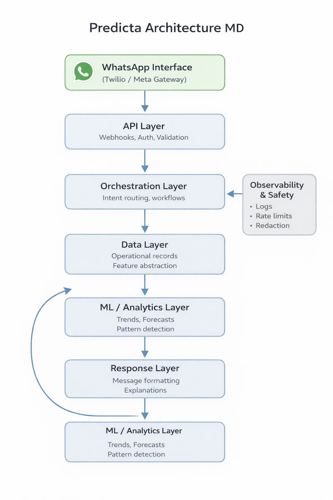

# System Architecture (High-Level)

This diagram and notes describe Predicta at a high level for academic review.
Details that would expose proprietary implementation are intentionally omitted.

## Diagram
> The diagram below shows the major components and data flows.

## Notes (Abstract)
- Conversational interface receives user intents and messages.
- Orchestration services validate inputs and route requests.
- Data layer stores operational records and derived features.
- ML/analytics services generate insights and summaries.
- Response layer formats results into user-friendly WhatsApp messages.
